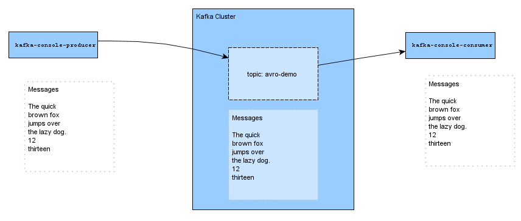
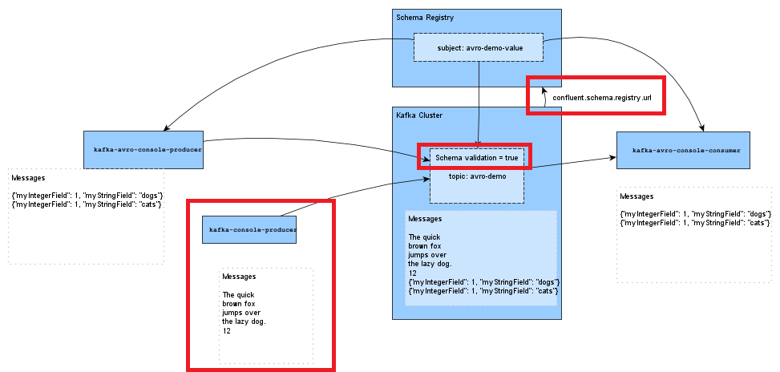

# 101 Schema Registry AVRO CLI demo/tutorial

In this demo I will show some basic charateristics of applying an avro schema to your Kafka topic using 
the Confluent Schema Registry and the Kafka CLI tools. 

### Outline
In this demo/tutorial we will
* start a single node local development cluster and configure the broker with a schema registry URL.
* create a topic and -from the command line- produce some strings and consume those strings.
* apply a value-schema using the Confluent Control Center
* produce some strings and consume those strings, WTF?
* produce and consume avro messages from the command line. 
* break it in many different ways. 
* apply broker-side validation to prevent some breakage, and break it in new ways. 


## Prerequisites
* Installed Confluent Platform. Mine is `7.2.0`
* `confluent` CLI. Mine is `v2.22.0`

And FWIW. I'm running Ubuntu 20.04 on WSL2/Win11


Oh. And. I will use 3 terminal windows. So if your terminal is capable of it, open three windows and name the first one `Control`, the second `Producer` and the third `Consumer`. 

### Confluent Platform.

This demo uses Confluent Platform, so you'll have to have access to one of those. If you don't access to an existing one, you can use the `confluent local` to run a local development cluster. Make sure you configure you broker with `confluent.schema.registry.url`.

Use your `Control` terminal to start and configure a Confluent Platform.  

``` 
$ confluent local services start
```

Optionally. You don't really need the `ksql-server` and the `connect` nodes, so you can stop them if you want. Use the commands `confluent local services ksql-server stop` and `confluent local services connect stop` repsectively.

### Ensure broker config `confluent.schema.registry.url` is set

To enable brokerside schema validation, the broker needs to be configured with a `confluent.schema.registry.url`. The demo broker as launched by `confluent local` above doesn't contain this config, so we need to add it. This config cannot be added dynamically, so we'll stop the broker, then copy the broker config file, add the config and restart the broker. We'll use the  kafka tools `kafka-server-stop` and `kafka-server-start`.

I add `confluent.schema.registry.url=localhost:8081` to the broker configs and start the broker again. 

Use these steps. 

```
kafka-server-stop
sleep 20
cp $(confluent local current)/kafka/kafka.properties ./kafka-avro-cli-demo.properties
echo "confluent.schema.registry.url=http://localhost:8081" >> kafka-avro-cli-demo.properties
kafka-server-start -daemon kafka-avro-cli-demo.properties
```

Note that both `kafka-server-stop` and `kafka-server-start` take some time to complete. So I added `sleep 20` in the script above. You may also need to give it a few moments at for the broker to be up and running, before continuing with the steps below. 


## Demo Steps

### Create topic

```
kafka-topics --bootstrap-server localhost:9092 --create --topic avro-demo
```

With our `avro-demo` topic created we're ready to start our production and consumption examples.

## Scenario 1 - Baseline
In this scenario we will use the `kafka-console-consumer` and `kafka-console-producer` to represent our Consumer and Producer apps. These two `kafka`-tools use String serialization and deserialization. Any data passed into the Producer and any data resulting out of the Consumer is treated as a string. 



In your Consumer terminal start a consumer. In your producer terminal start a producer. I've displayed an example here side-by-side.


```
kafka-console-consumer --bootstrap-server localhost:9092 --topic avro-demo
```

```
kafka-console-producer --bootstrap-server localhost:9092 --topic avro-demo
```

Now you can produce some String data. 

### Produce some strings
```
The quick
brown fox
jumps over
the lazy dog.
12
thirteen
```

### Validate 
You should see the produced strings appear in the Consumer terminal. 

You should also validate that the strings were produced as expected in the Control Center 
Messages view for the `avro-demo` topic. Navigate to your Control Center (http://localhost:9021/)
and then to topics `avro-demo` topic. You should be able to see the strings in the Messages tab by 
jumping to the right offset (if not sure, try Partition 0 offset 0).


### Scenario 2 - Add an avro schema

tldr; I add a schema, but nothing changes

We'll apply a schema to the `avro-demo` topic using the Control Center.
You can apply schema to the key and/or to the value of a Kafka message. 
I this demo we're not concerned with keys, so we apply one only to the value. 


In Control Center navigate to the Schema tab on the `avro-demo` topic. Ensure the `Value` button 
is active and click the Set a Schema button. Paste the example schema from below into the schema editor


Note that the schema is defined as `sample_record` with an integer and a string field. 
It wants data to look like this in json form: `{"myIntegerField": 1, "myStringField": "dogs"}`

```
{
  "type": "record",
  "namespace": "io.confluent.avro_cli_demo",
  "name": "sample_record",
  "fields": [
    {
      "name": "myIntegerField",
      "type": "int"
    },
    {
      "name": "myStringField",
      "type": "string",
      "default": "DefaultString"
    }
  ]
}
```

After you do this, take note of the `Schema ID`. You will need it below.


Ok. Now for the bit were nothing happens: You can still use the same producer and consumer (probably 
both still running from the section above) to produce any data to the topic that has the schema attached. 
Try it:

Totally non-schema-compliant data
```
Eiffel tower
Taj Mahal
Colossus of Rhodos
```

What's more, you can actually produce data _that looks compliant with the schema_ but in the producer and consumer 
that we are running at the moment, the data will just be treated as strings. Try it.

Seemingly compliant data:
```
{"myIntegerField": 1, "myStringField": "dogs"}
{"myIntegerField": 2, "myStringField": "cats"}
```

Why? Well the topic doesn't enforce schema compliance. And the `kakfa-console-producer` uses the String serializer, and therefore is just producing bytes that represent a datatype String. The `kafka-console-conusmer` is just consuming bytes and deserializing them to String again. 

Note that the seemingly compliant data you produced above, is just treated as plain Strings as well. 

What we _want_ is to serialize the data with an AVRO serializer that is aware of our schema. 

## Scenario 3 - Avro serialization and deserialization 

To really start using the constraints set by the schema we need to produce and consume using 
avro aware tools. We'll use the Kafka command line tools `kafka-avro-console-consumer` and 
`kafka-avro-console-producer`.

So in your produce and consume terminals above stop the running producer and consumer. We're about to start an 
Avro-enabled one of each.


### Avro enabled consumer + producer

I'm starting a producer and a consumer that are completely analog to the ones we started above, except that they 
are avro capable and aware of our schema. So I'm using `kafka-avro-console-*`, and setting the properties 
`schema.registry.url` and `value.schema.id`.Note that I'm pointing the `value.schema.id` property on both the 
producer and consumer to the `Schema ID` found above. In my case it was `1`.

In you Consumer terminal start a an AVRO consumer
```
kafka-avro-console-consumer \
  --bootstrap-server localhost:9092 \
  --topic avro-demo \
  --property schema.registry.url=http://localhost:8081 \
  --property value.schema.id=1 
```
In your producer terminal start an AVRO producer
```
kafka-avro-console-producer \
  --bootstrap-server localhost:9092 \
  --topic avro-demo \
  --property schema.registry.url=http://localhost:8081 \
  --property value.schema.id=1 
```

I can now produce compliant data, that are predictably shown in the AVRO enabled consumer.

```
{"myIntegerField": 3, "myStringField": "fish"}
{"myIntegerField": 4, "myStringField": "lions"}
```

If I now attempt to produce non-compliant data. I get a producer error. The CLI tool actually breaks. 
You need to restart it to try again. But in a development context you might catch this error and do 
something meaningful with it.  Try the examples, 1 by 1. Restart the producer when it fails.

```
{1, "dogs"}
Pyramids of giseh
{"myIntegerField": 5, "myStringField": "birds"}
```

Ok. That last one complied with the schema again, so it didn't fail. Nice decoupling, don't you think? 
The producer errored fatally, twice, and the downstream consumer didn't blink. 


### Breaking things on the consumer side

Now let's break it in a different way, on the consumer side. 

Stop the AVRO consumer and restart it with the `--from-beginning` argument. Remember that the topic has both 
AVRO data in it (the last few messages we produced) and non-avro string data (from earlier). What do you think will happen?
```
kafka-avro-console-consumer \
  --bootstrap-server localhost:9092 \
  --topic avro-demo \
  --property schema.registry.url=http://localhost:8081 \
  --property value.schema.id=1 \
  --from-beginning
```
Remember that we produced al those string earlier? Like `The quick` and `the lazy dog`? Those strings are still in the topic, and they can happily exist there. But our schema aware consumer cannot handle those, so it breaks fatally when it encounters them. In a development context you could catch the error and do something with it. 

### Bonus exercise. 
Try to read all data (i.e. `--from-beginning`), both avro serialized and string serialized from the topic using the standard cli consumer from above (`kafka-console-consumer`). What happens? Can you read the Avro data with the String deserializer?


### Summary
OK. So with an avro-enabled producer we can prevent non-compliant data going into the topic, and with a avro-enabled consumer we can prevent non compliant data going further downstream. 

But. We have also seen that if we use a _non-avro producer_, we can still put non-compliant data into our topic. Can we prevent that?


## Scenario 4 - Broker-side schema validation
You can use the topic configuration for _Broker-side schema validation_ to help ensure producers don't produce non-compliant data to your topic. 



Using the topic configs. Set `confluent.value.schema.validation` to `true`. If you prefer you can find and configure the _value schema validation_ config in the Control Center. 

```
 kafka-configs \
  --bootstrap-server localhost:9092 \
  --alter \
  --entity-type topics \
  --entity-name avro-demo \
  --add-config confluent.value.schema.validation=true
```
Now, using the non-avro (i.e. Strings) producer we'll try to produce non-compliant data to the topic that now has both a value-schema set, and has `value.schema.validation` enabled. Use the same command as above in your producer terminal:

```
kafka-console-producer --bootstrap-server localhost:9092 --topic avro-demo
```

And add some non-compliant data (restart the producer if you need). 
Ddon't forget to run a consumer along side. It'll be underwhelming, but it's important to 
realise that with this set up you downstream applications are protected against 
non-compliant data. 

```
Family Doge
Polly wants a cracker
```

What do you notice? The messages fail to produce, but not quite _immediately_. It takes a second or so, because the 
failure originates at the broker, so a network round-trip away. An additional bonus is that this type of failure 
isn't fatal for the `kafka-console-producer`.

Note that _seemingly compliant data_ is still treated a strings in this producer, so it still won't comply. 
```
{"myIntegerField": 1, "myStringField": "Canidae"}
{"myIntegerField": 5, "myStringField": "Aves"}
```

## Summary

So in the steps above we've seen how to produce string data to a topic using a CLI producer, and how to 
consume those strings using the console consumer. They're using the String Serializer and Deserializer respectively.  

We've also seen that you can apply a _value schema_, but that doesn't prevent non-compliant data going into the topic 
or coming out of it. 

To use the schema we need a producer and a consumer that are schema aware, in our example the `kafka-avro-console-producer`
and `kafka-avro-console-consumer`. They're using the Avro Serializer and Deserializer respectively, and it is schema aware.  

Our Kafka topic can receive both schema compliant data, serialized with the appropriate avro schema as well as non-compliant data. Configuring the topic for broker-side validation makes the broker validate that the schema was applied to the message. In this way it helps prevent non-compliant data entering your topic.


## What next
This demo/tutorial has shown some basic characteristics of schema as it relates to a topic. If -like me- you come
from a background in relational DBs, then you'll notice a few differences when thinking about schemas. 

There's many more things to learn about schemas. Here's a few ideas.

* Different schema definitions: Avro, Protobuf. JSON Schema. 
* Using my Schema data in my applications
* Schema evolution. How to change schemas without disrupting your applications
* Different schema strategies: `TopicNameStrategy`, `RecordNameStrategy` and `TopicRecordNameStrategy`


# Additional commands

```
curl -s localhost:8081/subjects | jq

```


# Tear down

You can stop the development cluster using the `confluent local services stop`. 
But because we started the broker with the `kafka-server-start` command you need to stop it separately
using `kafka-server-stop`. If you want to be thorough, you can use `confluent local destroy` to remove 
all the data and config files of your local development cluster from the `/tmp/` directory on your system 

And that file `kafka-avro-cli-demo.properties` that you created early on. You should remove that too.
