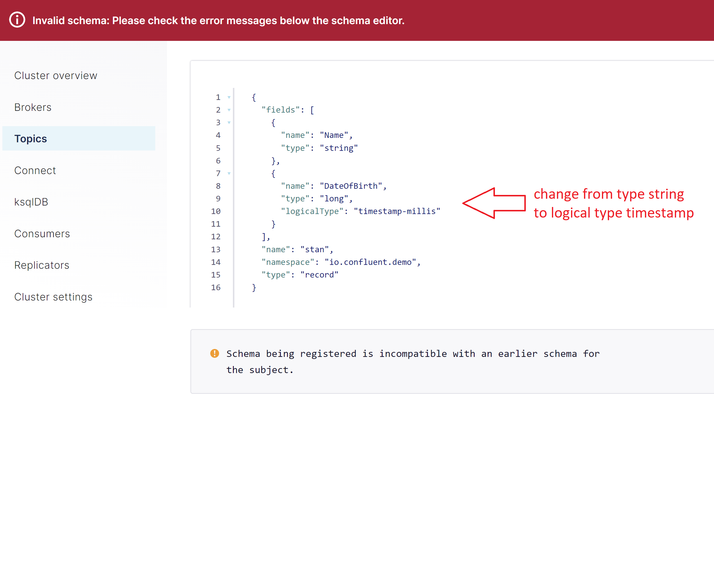
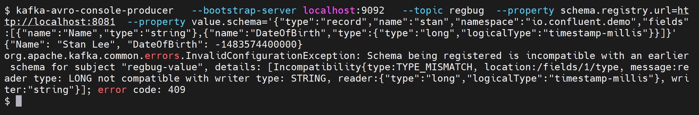
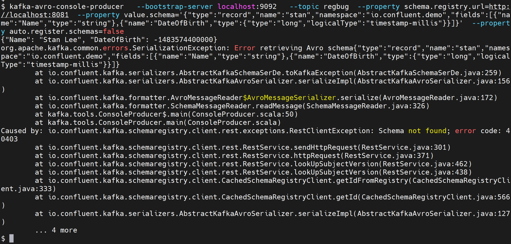

# What's this?
This is a small that illustrates an example from Confluent Schema Registry enablements. It shows a number of different errors/failures in the context of evolving schema's in unsafe ways. The example uses the schema registry configured (default) to enforce BACKWARD compatibility, and topic configure with the schema subject naming strategy for the value of `TopicNameStrategy`.

What is coming?
* start node
* create topic
* create version 1 value schema

* fail evolving using Control Center

* fail using avro-cli producer tool
* fail using avro cli producer tool differently

## Steps

### Prerequisite
start local dev node

create topic `stan-demo`

```
kafka-topics --bootstrap-server localhost:9092 --topic stan-demo --create
```

add value schema
(assumptions TopicName Strategy, SR enforces Backward Compatible)
```
{
  "fields": [
    {"name": "Name","type": "string"},
    {"name": "DateOfBirth","type": "string"}
  ],
  "name": "stan",
  "namespace": "io.confluent.demo",
  "type": "record"
}
```


## Try using C3
Try to evolve it by changing the `DateOfBirth`
definition:
```
...
    {
      "name": "DateOfBirth",
      "type": "long",
      "logicalType": "timestamp-millis"
    }
...
```


 this fails at register time in C3



## Try using CLI-producer

I'll use the `value.schema` `property` in this example

```
kafka-avro-console-producer  \
 --bootstrap-server localhost:9092  \
 --topic stan-demo \
 --property schema.registry.url=http://localhost:8081 \
 --property value.schema='{"type":"record","name":"stan","namespace":"io.confluent.demo","fields":[{"name":"Name","type":"string"},{"name":"DateOfBirth","type":"string"}]}'

```

valid value for Stan

```
{"Name": "Stan Lee", "DateOfBirth": "28/12/1922"}
```

invalid value for Stan
```
{"Name": "Stan Lee", "DateOfBirth": -1483574400000}
```

start console producer with timestamp schema.

```
kafka-avro-console-producer  \
 --bootstrap-server localhost:9092  \
 --topic stan-demo \
 --property schema.registry.url=http://localhost:8081 \
 --property value.schema='{"type":"record","name":"stan","namespace":"io.confluent.demo","fields":[{"name":"Name","type":"string"},{"name":"DateOfBirth","type":{"type":"long","logicalType":"timestamp-millis"}}]}'

```

This producer fails the string DOB, (try it if you must). I'm jumping straight into producing the timestamp version of this data here, which is now _valid_ according to the schema that the producer is using: Valid value for Stan
```
{"Name": "Stan Lee", "DateOfBirth": -1483574400000}
```

This also fails even though it is new-schema-compliant (i.e. timestamp definition) because (IMPORTANT DETAIL FOLLOWING HERE): _the producer attempts to **register the schema** before producing the data. This registration attempt fails because the schema is not backward compatible with the existing schema in the schema registry and the SR setting enforcing Backward compatibilty._ This is not an error at _producing time_, it is an error at _schema registering time_. 




What if we don't register the schema?

## turn off auto.registering

autoregistering ischema is a producer config, so let's start a producer with autoregisttering turned off
```
kafka-avro-console-producer  \
 --bootstrap-server localhost:9092  \
 --topic stan-demo \
 --property schema.registry.url=http://localhost:8081 \
 --property value.schema='{"type":"record","name":"stan","namespace":"io.confluent.demo","fields":[{"name":"Name","type":"string"},{"name":"DateOfBirth","type":{"type":"long","logicalType":"timestamp-millis"}}]}' \
 --property auto.register.schemas=false
```

This also fails, because the schema isn't found. 




### Tear down
...
